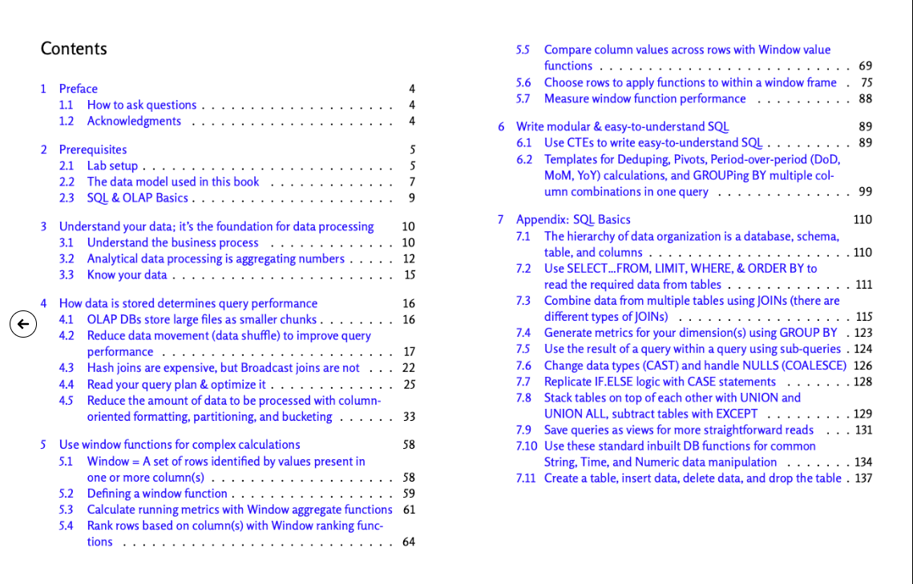

# SQL Preparation Repository

Welcome to my SQL Preparation Repository, where I share my SQL skills through practical exercises and challenges. This repository is a showcase of my SQL journey, featuring solutions to HackerRank challenges and extensive work on data processing with SQL.

## HackerRank Challenges

  

In the `hackerrank-challenges` directory, you'll find my solutions to various SQL challenges hosted on [HackerRank](https://www.hackerrank.com/).

## Analytical Data Processing in SQL

  

The `analytical-data-processing-sql` directory contains advanced SQL queries and data processing examples. You can view this dedicated repository [here](analytical-data-processing-sql).

## Website

For more information on the book, visit:  
  <a href="https://josephmachado.gumroad.com/l/analyticalsql">Efficient Data Processing in SQL</a>

